# BGA asynchronous pipeline

Requirement: [IR#478 comment](https://github.com/BMS-Mania/IR/issues/478#issuecomment-5317264637)
and its [implementation brief](https://github.com/BMS-Mania/IR/blob/issuebridge-assets/discord-attachments/issue-478/message-1538928551779237999/1538928551598759996-codex-bga-pipeline-optimization-instructions.html).
Tracker and continuation notes: [#413](https://github.com/tenP0312-dev/oraja/issues/413).

Video decoding can fall behind without making the game wait for it. The GL
thread polls a fixed set of ready leases, selects the newest available frame
at or before the video target PTS, and otherwise redraws its current texture.
The game clock, notes, input, judgement, replay and Arena protocol remain the
existing independent authorities. This change is source development; it does
not publish a binary or establish physical performance acceptance.

## Source responsibilities

| File | Responsibility |
| --- | --- |
| `BGAProcessor` | Chart/movie descriptors, timeline starts, READY gate and main/layer/miss drawing |
| `BgaTimelineSchedule` | Precomputed movie-only timeline; binary search for next distinct main/layer |
| `BgaPlaybackCoordinator` | Priority admission, generation and last-request mailbox, fixed workers, GL upload |
| `FFmpegVideoDecoder` | Worker-only disk lease, native open/seek/decode/RGB conversion and deterministic close |
| `DecodedFrameQueue` | Fixed native RGB leases with atomic FREE/WRITING/READY/READING ownership |
| `BgaMemoryBudget` / `BgaQualityProfile` | Atomic admission budget and frozen normalized session limits |
| `BgaPerformanceMetrics` | Bounded atomic samples/counters, Performance Monitor and TimingDiagnostics integration |
| `Config`, `VideoConfigurationView` | Persisted limits, quality/rollback/statistics controls and migration |

```mermaid
flowchart LR
  T[Game timer and timeline] --> C[Coordinator: main/miss, layer, next events]
  C --> M[One replaceable mailbox per bounded worker]
  M --> D[Worker: open, seek, decode, scale and RGB]
  D --> Q[Fixed native leases: generation and PTS]
  Q --> P[GL: immediate poll at or before target]
  P --> U[Reuse RGB Pixmap and Texture]
  U --> V[BGA draw or previous texture]
```

## Current source versus the old route

The rollback route remains `FFmpegProcessor`, with its existing command tests,
stride handling and equal-size texture reuse. It eagerly starts a worker for
each movie resource, retains the whole movie with `readAllBytes`, shares a
Pixmap lock between frame copy and GL upload, and posts a runnable for each
decoded frame. `getFrame` itself already returned quickly, but posted GL work
could wait for that shared lock or upload the same newest Pixmap repeatedly.

The new route constructs inexpensive movie descriptors during model loading.
It opens only admitted sessions on at most two workers by default, with one
FFmpeg codec thread per session. A local file is opened directly; an archive
entry uses a per-session, single-file `materializeBatch` disk lease. Its disk
lease stays alive through native close, avoiding heap retention or eviction
of an in-use materialized file. Disk I/O and archive locks remain worker-only.

The current main/miss uses priority 1, current layer 2, next main 3, next layer
4, miss first frame 5. Current requests are admitted before speculative ones;
two current streams leave no speculative slot under the default decoder cap.
Next main/layer preload is limited to two resources, within the profile window.
No chart-wide open, unbounded executor, command FIFO or per-movie render callback
is used in the new route.

## Concurrency and lifecycle

- GL never takes a decoder lock, waits for a future, joins a worker, or takes
  from a blocking queue. Worker parking and native close happen off GL.
- Each lease has one owner. A producer can replace an unread oldest READY
  frame when full, but cannot overwrite READING pixels. GL releases its lease
  in `finally`; the worker retires the queue and drains outstanding read leases
  before freeing native storage.
- Each playback request has a chart/play generation, unique token and event
  start. Model replacement, READY/retry preparation and detected seeks invalidate
  old playback. Queue frames carry the token; old frames and old textures cannot
  satisfy a new request. Target PTS is derived from the existing game time and
  event start; a repeated same-ID event restarts playback with a new token.
- Requests replace the mailbox instead of accumulating. Practice-like clock
  jumps are debounced for 75 ms; the latest request wins. Native catch-up seeks
  beyond 500 ms; smaller normal gaps continue decoding and discard stale frames.
- A CAS-protected worker binding prevents a slow old open/close from replacing
  a movie's newer queue when ownership changes between workers.
- Main/layer/miss handles have independent starts even when they use the same
  BGA ID, while sharing that resource's once-only failure state. Speculative
  requests cannot overwrite an already admitted current playback.
- `beginPrepare` invalidates the previous play and prepares first main/layer.
  GL polls and uploads the first frame during preparation, with at most 500 ms
  of additional movie readiness gating. If unavailable, playback starts black
  and the worker continues. Static-image preparation retains its existing
  independent per-frame disposal/upload budgets.
- A session freezes size at open from source, quality, currently known BGA
  display bounds and memory budget. If skin bounds are unavailable in READY,
  screen resolution is the initial ceiling. The session is not dynamically
  resized during normal play. RGB upload uses `TYPE_LINEAR`; the rollback route
  retains its existing BGR-swapping `TYPE_FFMPEG` shader.
- Same-size Pixmap and Texture are reused, including across retry when retained.
  Pixel buffers are allocated per admitted session, never per decoded frame.
  Texture create/dispose occurs at initial readiness, resource/session change
  or lifecycle cleanup, never on the decode worker.
- Stop/dispose invalidates requests immediately and closes native resources
  asynchronously. A failed resource is disabled once, with one warning, and
  never retried each frame. A different valid movie can continue normally.

## Configuration and rollback

The video settings page adds **BGA quality**, **Async video BGA** and **BGA
statistics in Performance Monitor**. Apply session configuration after restart.
Old configs default to BALANCED with async enabled and statistics disabled.
Missing/null/unknown quality names normalize to BALANCED.

| Mode | fps cap | Size cap | Queue leases | Next-event window/count |
| --- | --- | --- | --- | --- |
| OFF | 0 | none | 0 | 0 / 0 |
| PERFORMANCE | 30 | 1280×720 | 2 | 500 ms / 1 |
| BALANCED | 60 | 1920×1080 | 3 | 750 ms / 2 |
| QUALITY | 60 | source/display/budget | 3 | 1250 ms / 2 |

Internal config fields are `bgaQualityMode`, `bgaAsyncPipeline`, `bgaMaxFps`,
`bgaMaxWidth`, `bgaMaxHeight`, `bgaPreloadWindowMs`, `bgaPreloadResourceCount`,
`bgaDecodedQueueLength`, `bgaDropLateFrames`, `bgaMaxActiveDecoders`,
`bgaNativeMemoryBudgetMb`, and `bgaShowPerformanceStats`.

Zero fps/width/height/queue overrides select profile defaults. Preload `-1`
selects the profile default; explicit zero disables speculative preload. Values
normalize to fps 15/24/30/60 (invalid → profile default), dimension 0–7680/4320,
window -1–2000 ms, preload count -1–3, queue 0–4, decoder count 1–3 and budget
16–512 MiB. Runtime speculative count is conservatively capped at two.
Default decoder cap is 2 and budget is 128 MiB. Global BGA OFF and quality OFF
never open a video or start a new BGA worker, including with rollback selected.
Static-image behavior follows the existing global BGA switch.

To roll back, set `bgaAsyncPipeline=false` and restart. The original movie
processor is then used; new quality caps/worker bounds apply to the async
route, while quality OFF still suppresses movies in both routes. No source
version, protocol, release manifest or production setting is changed.

## Budgets and measurement boundaries

`bgaNativeMemoryBudgetMb` bounds owned native RGB staging and reserves converter,
upload Pixmap and estimated RGB texture storage. Admission divides the budget
among allowed sessions and further scales output to fit. The accounting is
not a process RSS cap: compressed archive disk files, FFmpeg demux/codec/reference
frames and GPU driver allocations are outside this owned-buffer bound. The
brief's hard total-native-memory acceptance therefore still requires operator
measurement and possibly a separately reviewed codec accounting/admission policy.

GL applies a 2 ms **soft** cumulative upload budget per game render frame, shared
by BGA skin objects through `Gdx.graphics.getFrameId()`. It stops
admitting further uploads after the budget is spent and separately caps upload
rate. One driver upload cannot be preempted. Overshoots are counted. This source
does not claim a hard 240 Hz deadline under arbitrary driver or storage stalls.

Enable `bgaShowPerformanceStats` to view p50/p95/p99/max, counts, active/preloaded
decoders, queue depth and owned-byte reservations under Performance Monitor's
BGA section. Each interval retains 1024 samples, lifetime count/max and bounded
counters; monitor snapshots update every 500 ms. With `timingDiagnostics` on,
the existing bounded diagnostic summaries receive the new stage/counter names.
`RENDER_WAIT` records zero by construction for decoder waits; it is not a
measurement that all GL drawing or driver work takes zero time. Actual poll,
upload, draw and game frame timing must be examined together.

## Verification and operator acceptance

Automated tests cover PTS/generation selection, retained future frames, full
queue eviction without overwriting a read lease, concurrent pixel publication,
asynchronous close, bounded priority admission, blocked-open nonblocking behavior,
worker ownership changes, last-request retry coalescing, per-resource failures,
OFF, old/invalid config migration, stride/RGB, memory admission and rolling metrics.
A self-authored FFV1 Matroska fixture is generated by the pinned JavaCV/FFmpeg
libraries for native decode, preload, seek/retry and deterministic budget-release
checks; no game/launcher/GUI/audio device is launched by these tests.

Commands: `./gradlew core:test` and
`./gradlew -Dplatform=linux -Darch=x86-64 core:shadowJar` with the repository's
pinned wrapper, JDK17 plus JavaFX. The cloud requires the platform HTTPS proxy
and system Java truststore; its environment-only init script uses Google's
Maven Central mirror after primary-host HTTP429. Repository dependency versions,
TLS verification and checksums are preserved.

Physical acceptance remains operator-run, linked to #212. Capture the same
chart/system for BGA OFF, static image, rollback video and each new quality mode.
Record source format/resolution/fps, display Hz/VSync, audio backend/buffer,
game-frame p50/p95/p99/max, budget overshoots, decode/upload/wait times, dropped
frames, native/RSS/driver memory and audio underflows. Compare judgement, replay
and controlled Arena outcomes to the existing source; no data equivalence or
performance improvement is asserted from the headless tests.

Required physical matrix: no BGA/static/480p30/1080p60/4K60; H.264/H.265/VP9,
VFR/long GOP; broken/EOF/negative or offset PTS/no index; rapid main/layer/miss
switches, retry/seek and end-of-song changes; Alt+Tab; CPU/GPU/storage/memory
stress; ASIO/WASAPI exclusive 64/128/256 samples; 60/120/144/240 Hz and VSync
on/off. Targets from the brief are game-frame p99 below 16.67/8.33/4.17 ms at
60/120/240 Hz and no worse underflows than the BGA OFF/current-route baseline.
These measurements are pending. PBO, hardware decode, shared surfaces and
LaneRenderer redesign remain later phases.

Before a five-hour execution limit, update #413 with the pushed branch/SHA,
completed and remaining work, exact validation results and resumption steps.
Unfinished or operator-pending PRs stay Draft for administrator handoff. The
user has prohibited pushing from this environment: export a review patch and
PR description and save the patch in Issue comments if no remote branch exists.
This local change does not itself create a GitHub PR.
